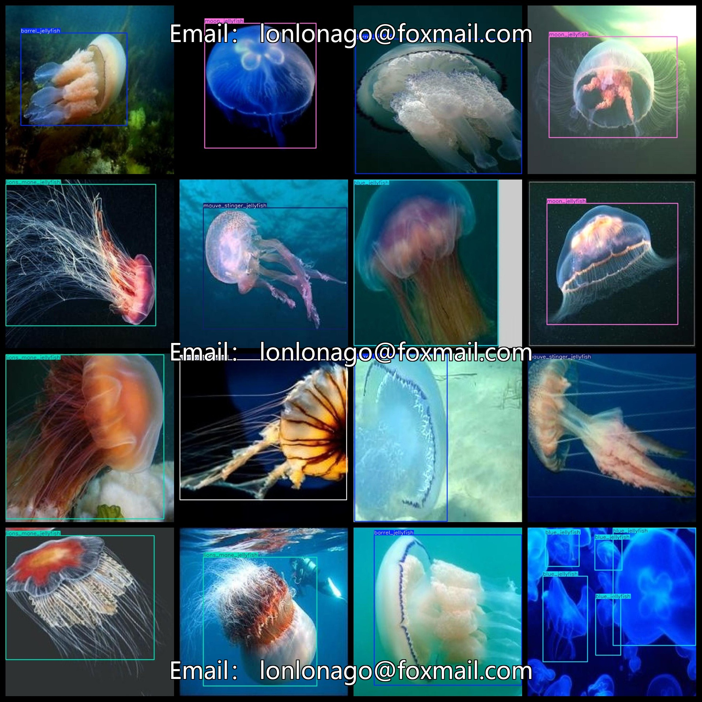

# Water Female Dataset 867 images6-classVOC+YOLO format

The data set of jellyfish contains 867 images in the format of VOC+YOLO.

Dataset format: Pascal VOC format + YOLO format (the txt file does not contain the split path, it only contains jpg images and corresponding VOC format xml files and yolo format txt files)

Number of images (Total jpg files): 867

Number of xml files: 867

Number of txt files: 867

Number of categories: 6

The Github repository is: datasets_sl

['barrel_jellyfish', 'blue_jellyfish', 'compass_jellyfish', 'lions_mane_jellyfish', 'mauve_stinger_jellyfish', 'moon_jellyfish']

Typhoid Stinger, Blue Wrasse, Compass Worm, Lion's Mane, Purple-red Stinger, Sea Moon

Number of boxes labeled in each category:

Barrel Jellyfish = 157

Blue Jellyfish box count = 279

The number of compass_jellyfish is 154.

lions_mane_jellyfish frame count = 155

Majority Element: 147

The number of moon jellyfish is 218.

Total number of frames: 1110

Number of images per category:

Barrel Jellyfish owns 143 images.

blue_jellyfish_occupies_148

compass_jellyfish has 144 images

Lion's Mane Jellyfish occupies 145 images.

Mauve Stinger Jellyfish has 143 images.

Moon jellyfish owns 144 images.

Image resolution: 640x640

Use the labeling tool: labelImg

Dataset Augmentation: No

Rules for annotation: Draw a rectangle around the category.

Important note: The dataset does not have been divided into training, validation, and testing sets.

Special Disclaimer: This dataset does not guarantee the accuracy of the trained models or weight files.

Annotation and image details are as follows:

## Images

---

Here is a pay link on Stripe (https://buy.stripe.com/3cs8yP7sY87d0vu9AB). Please contact me lonlonago@foxmail.com after funding $89, and I will send you a complete data files, thank you!

